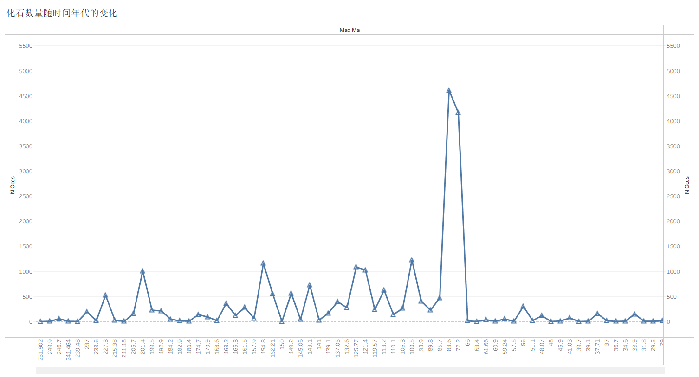
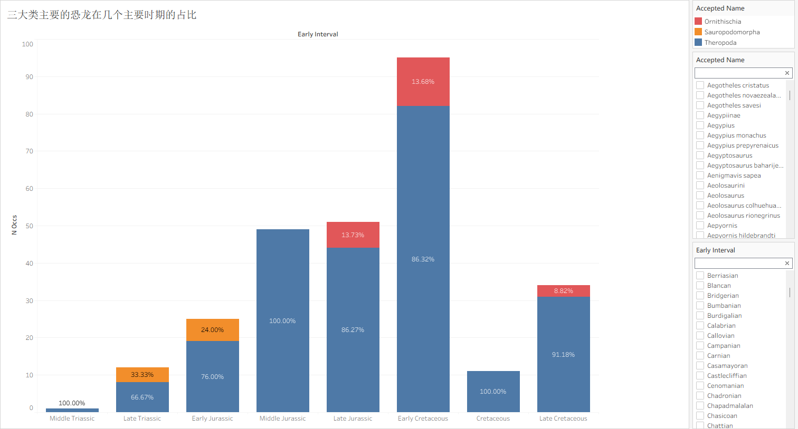
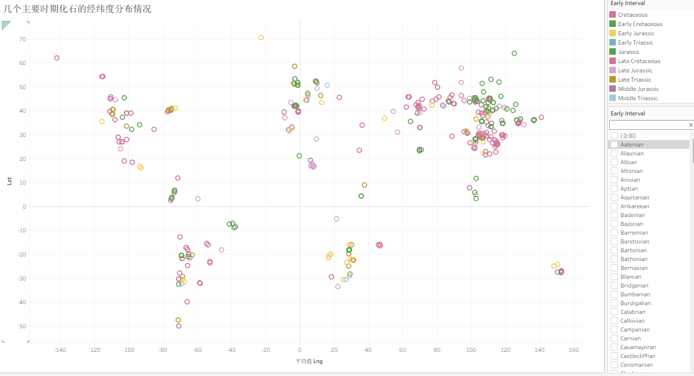
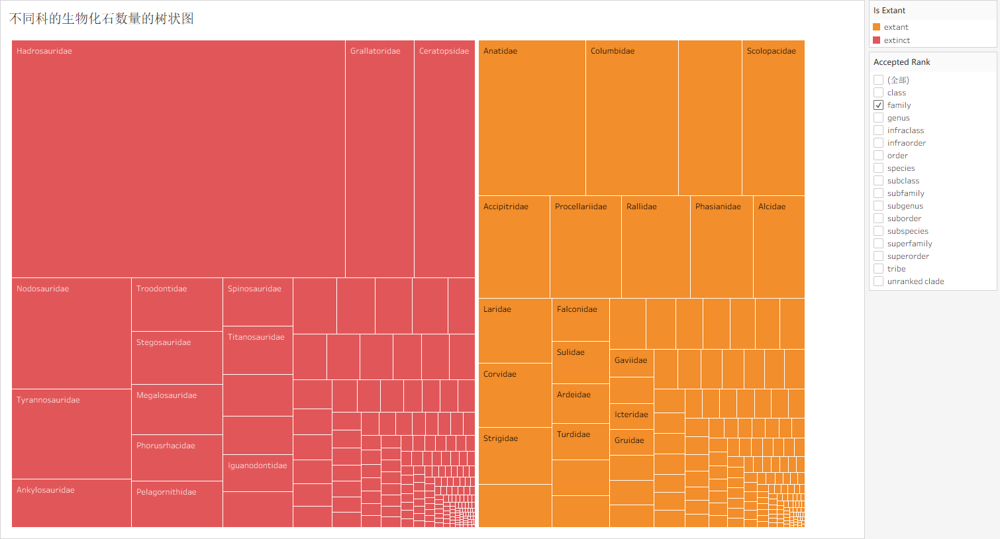

# 自然主题的统计图可视化报告
(计算机科学与技术 2304、许耿楠、20231003280)

## 1、 本作业的链接

<https://public.tableau.com/app/profile/20231003280/viz/hw1_17741665958760/sheet3>

## 2、数据来源及概述

数据通过 PBDB（Paleobiology Database）API 获取。PBDB 是一个全球性的古生物数据库，主要收录化石的分类体系、地理分布及地质年代信息。本次数据以恐龙相关化石记录为主，并围绕三个核心数据表进行组织与分析：

#### 1. 采集点表（collection）

字段包括`collection_no, formation, lng, lat, collection_name, n_occs, early_interval, late_interval, max_ma, min_ma`。

该表以“化石采集地点”为单位，提供空间与环境信息：

* `lng, lat` 描述地理位置（用于地图可视化）。
* `n_occs` 表示该地点的化石记录数量。
* `early_interval, late_interval` 表示所属地质时期。

#### 2. 化石出现记录表（occurrence）

字段包括`occurrence_no, collection_no, accepted_name, accepted_rank, early_interval, late_interval, max_ma, min_ma`。

该表以“单条化石记录”为单位，描述具体分类单元在时间维度上的分布：

* `accepted_name / rank` 对应具体类群。
* `early_interval, late_interval` 表示所属地质时期。
* `max_ma, min_ma` 提供精确的时间范围（百万年前）。
* `collection_no` 用于关联具体采集地点。

#### 3. 分类表（taxon）

字段包括`taxon_no, accepted_name, accepted_rank, parent_no, is_extant, n_occs`。

该表描述生物的系统发育层级结构（如科、属、种等），其中：

* `accepted_name` 和 `accepted_rank` 用于标准化分类名称及层级。
* `is_extant` 区分现生与灭绝类群。
* `n_occs` 表示该类群对应的化石记录数量（可用于规模比较）。

这种结构适合从多个维度分析恐龙化石的分布特征，例如：不同类群在地质时期中的演化趋势、化石记录在全球范围内的空间分布，以及现生与灭绝类群在样本规模上的差异。

下面是三张表的api链接：

<https://paleobiodb.org/data1.2/taxa/list.csv?base_name=Dinosauria>

<https://paleobiodb.org/data1.2/colls/list.csv?base_name=Dinosauria>

<https://paleobiodb.org/data1.2/occs/list.csv?base_name=Dinosauria>

## 3、 可视化实现过程

使用 pandas 清理部分无用字段，然后将三个表导入 tableau ，因为第二个可视化方案要用到 occs 和 colls 两张表，所以这里还要将这两张表进行连接，还要进行数据的筛选，将主要的时期和类群筛选出来，大部分的地质时期内容都是很细化的，所以要使用主要的地质时期，而非所有的地质时期。同时类群也是一样的要将主要的挑选出来，不然整个图会变得很乱，对于普通人了解相关的内容也没有意义。

## 4、 可视化方案

1. 通过折线图展示恐龙化石数量随时间年代的变化。
2. 通过堆叠条形图展示三大主要恐龙类群随在几个主要时期的占比。
3. 通过气泡图展示化石在几个主要时期不同经纬度的丰富度。
4. 通过树状图展示不同科属的生物化石数量。

## 5、 可视化结果

折线图横轴使用的是时间，以 Ma 作为单位，1 Ma 表示 1 百万年前，纵轴使用的是恐龙化石的数量。所以从图中可以看出恐龙化石记录数量在不同年代波动明显，其中在约 83.6 Ma 到 72.2 Ma 附近出现最显著峰值，说明这一时期相关化石记录最集中；其余年代整体处于较低水平并伴随小幅起伏。也可以看出在 72.2 Ma后，恐龙化石的数量急剧下降，可见白垩纪生物大灭绝对生态破坏之显著。

<figure style="text-align: center;">
  
  <figcaption>图1：化石数量随时间年代的变化</figcaption>
</figure>

堆叠条形图横轴是几个主要的古生物地质时期（三叠纪，侏罗纪，白垩纪），纵轴同样是化石数量，通过图里对类别进行区分（蓝色是兽脚类，红色是鸟臀类，黄色是蜥脚形类），同时将类群在特定时期的占比用文本标记出来。所以从图中可以看出在多个主要时期中，Theropoda（兽脚类）占比普遍最高，Early Cretaceous（白垩纪早期）的总记录量最高；Ornithischia（鸟臀类）与 Sauropodomorpha（蜥脚形类）仅在部分时期贡献较小比例，体现出类群结构的不均衡。

<figure style="text-align: center;">
  
  <figcaption>图2：三大类主要的恐龙在几个主要时期的占比</figcaption>
</figure>

气泡图的横轴是每一个化石点位的经度值，纵轴是纬度值，颜色代表的是不同的地质时期，同样是使用了三叠纪，侏罗纪，白垩纪这三个主要的时期。从图中可以反映化石点位在经纬度上呈现聚集分布，北半球中纬度区域（约 Lat 25-50）聚集最明显；同时南半球也存在若干次级聚类，说明不同地质时期的采集记录在空间上具有区域集中性而非均匀分布。也可以看出侏罗纪的化石主要分布在亚洲，而北美洲则以白垩纪居多。

<figure style="text-align: center;">
  
  <figcaption>图3：几个主要时期化石的经纬度分布情况</figcaption>
</figure>

树状图按科级单元对化石数量进行层次化的展示，方块面积越大表示记录越多，也说明了说明该类群在数据库中的记录越丰富、研究程度或保存情况相对更好。图中 Hadrosauridae（鸭嘴龙科）等科占据较大面积，说明其记录丰富；同时使用不同颜色区分 extant（现存的）与 extinct（已灭绝的），便于对比现生（主要是鸟类）与已灭绝类群在样本规模上的差异。

<figure style="text-align: center;">
  
  <figcaption>图4：不同科的生物化石数量的树状图</figcaption>
</figure>

## 6、 本作业的体会

通过本次作业，我熟悉了 PBDB 数据结构以及 Tableau 的基本使用流程。在数据处理过程中，体会到数据清洗的重要性。同时，对数据的可视化使我更直观地看到古生物的变化。我对数据可视化也产生了更深的理解。数据可视化应该追求人能够看懂，能够看明白，有意义，所以不应该把所有的数据都堆上去，最开始的时候缺少对数据的筛选，所以图上的大多数内容，我都不知道是什么意思。但是在筛选过后，感觉就变得明朗起来了。
